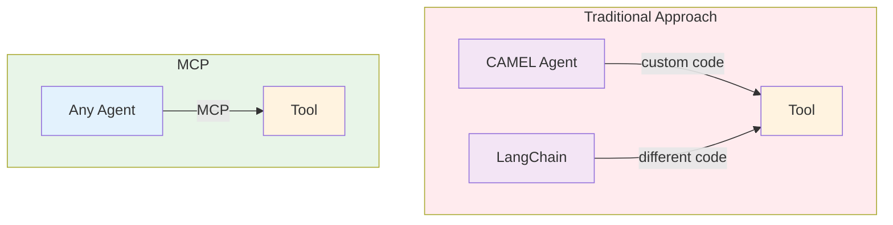

# Module 2: Introducing the Model Context Protocol (MCP)

**Objective:** Understand MCP, its principles, and how it solves tooling limitations.

## 2.1 What is MCP?

MCP is an open standard that lets AI agents use tools universally, no matter the model or provider. It's like a "USB-C port for AI"—a common plug that connects any agent to any tool.

## 2.2 Core Principles

- **Standardization:** Uses JSON-RPC 2.0 for consistent communication.
- **Model-Agnosticism:** Works with any AI system (GPT, Claude, etc.).
- **Openness:** Free and collaborative, avoiding vendor lock-in.
- **Context Awareness:** Provides real-time data access.
- **Security:** Includes encryption and user consent.

## 2.3 How MCP Solves Tooling Issues

MCP offers:

- **Common Interface:** One standard for all tools.
- **Plug-and-Play:** Tools work across providers without custom code.
- **No Schema Mismatch:** Unlike CAMEL's `agent.step` vs. LangChain's `chain.invoke`, MCP unifies tool calls.

**Reflection Question:**

How might MCP's standardization change AI development?
